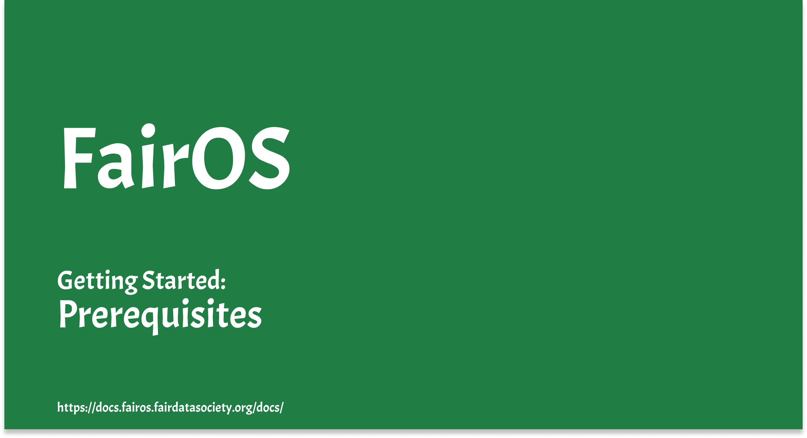

[](https://drive.google.com/file/d/18fkaPklSzFuXseJBbaINMxPeqFZDxZTc/view "FairOS prerequisites")

- Bee installation

https://docs.ethswarm.org/docs/installation/bee-clef

https://docs.ethswarm.org/docs/installation/install#install-bee

- Runnig your own Bee node

https://docs.ethswarm.org/docs/installation/install#configure-bee

- Funding your Node

https://docs.ethswarm.org/docs/installation/fund-your-node

- Widthdraw

https://docs.ethswarm.org/docs/access-the-swarm/keep-your-data-alive#fund-your-nodes-wallet
```
curl -XPOST "http://localhost:1635/chequebook/withdraw?amount=1000"
```

- Buying Stamp

https://docs.ethswarm.org/docs/access-the-swarm/keep-your-data-alive#purchase-a-batch-of-stamps
```
curl -s -XPOST http://localhost:1635/stamps/10000000/20
```

Full Guide : https://hackmd.io/FnU8B-8QQMKjARLIACtM0g